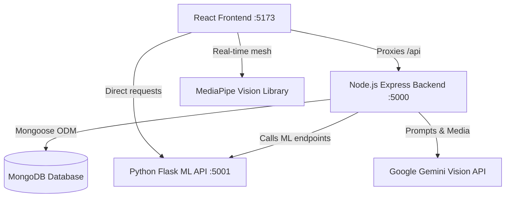

# 🧩 AutiSense — AI-Based Early Autism Detection System for Preschool Children

> **MCA Final Year Project** · A multi-modal early autism detection and screening platform designed for preschool children (ages 2–6). 
> By combining traditional behavioral screening (M-CHAT/F), computer vision (MediaPipe facial/gaze tracking), generative AI (Google Gemini Flash drawing/video metrics), and machine learning (scikit-learn Random Forest model), AutiSense delivers a unified, empathetic, and comprehensive screening report.

---

## 📸 Core Features

AutiSense is designed to support parents, pediatricians, and administrators through a modern, secure, and user-friendly portal:

### 1. 📋 Behavioral Screening (M-CHAT-R/F)
* **Interactive Questionnaire**: 20 M-CHAT questions split into 5 interactive, animated steps of 4 questions each.
* **Smart Validation**: Dynamic progress bars and locks prevent jumping ahead or leaving questions unanswered.
* **Risk Categorization**: Automatically computes and categories risk: **Low** (score 0–6), **Medium** (score 7–13), and **High** (score 14–20).

### 2. 👁️ Face & Eye Gaze Scanning
* **Live Webcam Integration**: Integrates directly with the user's webcam using `@mediapipe/tasks-vision` to track face/eye metrics in real-time.
* **Landmark Feedback**: Visualizes landmark meshes on a canvas to trace facial expressiveness, gaze stability, blink rate, and head position stability.
* **AI Analysis**: Captures brief video/frames and analyzes child social interactions, facial expressiveness, and eye gaze using Google Gemini Flash.

### 3. 🎨 Psychological Drawing Analysis
* **Drawing Upload**: Allows parents to upload drawings made by their children.
* **Gemini Vision Analysis**: Evaluates patterns (repetitive strokes, spatial layout, presence of social elements, motor control) often associated with developmental milestones.

### 4. 📊 Multi-Modal Composite Reports
* **Synthesis Engine**: Merges behavioral, visual (face/gaze), and drawing data into a single unified report.
* **Intelligent Recommendations**: Creates a tailored weekly action plan detailing focus areas (social, communication, sensory), daily interactive activities, and specialist referral recommendations.
* **Explainable AI (XAI)**: Visualizes which specific questions contributed most to the risk evaluation based on item-weighting models.

### 5. 🏥 Specialized Dashboards
* **Parent Portal**: Manage multiple children, check history logs, track progress, review combined reports, and update weekly intervention adherence metrics.
* **Doctor Portal**: Access child screening histories, review automated next-action indicators, analyze explainability metrics, and monitor longitudinal records.
* **Admin Dashboard**: A premium panel featuring pure CSS interactive analytics, risk distribution graphs, monthly trends, and live user management controls.

---

## 📐 System Architecture

The following diagram illustrates how the three microservices and external APIs collaborate:



### Flow of Data during Assessment:
1. **Behavioral**: Parent answers are scored locally and verified against the Flask ML Random Forest model.
2. **Biometrics**: Webcam data is captured, analyzed locally with MediaPipe, and processed remotely via the Express Backend by passing key visual indicators to Google Gemini Flash.
3. **Drawing**: Child drawing image is sent through the Express Backend to Gemini Flash for pattern analysis.
4. **Synthesis**: The Express backend combines results from all three modules, generates a composite score, updates child records, and writes to MongoDB.

---

## 🛠️ Technology Stack

### Frontend (`autisense/`)
* **Framework**: React 18 + Vite (for lightning-fast HMR)
* **Styling**: Tailwind CSS v4 (vanilla HSL tailored variables, orange-cream color scheme)
* **Icons**: Lucide React
* **Routing**: React Router v6
* **Client APIs**: Fetch API, MediaPipe Tasks Vision (`@mediapipe/tasks-vision`)

### Node.js Backend (`autisense-backend/`)
* **Environment**: Node.js + Express (ES Modules)
* **Database**: MongoDB + Mongoose ODM
* **Security & Auth**: JSON Web Tokens (JWT) stored in HTTP-only cookies, `bcryptjs` hashing, `helmet` headers, and `express-validator` sanitizer middleware.
* **AI Tooling**: Google Gemini (`gemini-flash-latest`) API integrations for drawing and face-eye video synthesis.

### Python ML Backend (`backend/`)
* **Web Server**: Flask + Flask-CORS (Port 5001)
* **Machine Learning**: `scikit-learn` (Random Forest Classifier, Standard Scaler, Label Encoders)
* **Analytics & Utils**: `pandas`, `numpy`, `matplotlib`, `seaborn`
* **Features**: Explainability parser, developmental next-action generator, and intervention plan structures.

---

## 🚀 Getting Started

### Prerequisites
1. **Node.js** (v18 or higher)
2. **Python 3.8+** (pip installed)
3. **MongoDB** (running locally or a MongoDB Atlas URI)
4. **Google Gemini API Key** (required for drawing and facial/video features)

---

### Easy Start (Recommended for Mac/Linux)

A launch script is provided in the root directory to orchestrate all services concurrently:

```bash
chmod +x run_project.sh
./run_project.sh
```

This script:
1. Starts the Node.js Express Backend in a new Terminal window on port **5000**.
2. Starts the React Frontend dev server in a new Terminal window on port **5173**.
3. Installs Python dependencies (`flask`, `flask-cors`, `scikit-learn`, `numpy`, `pandas`) and launches the Flask ML API in a new Terminal window on port **5001**.
4. Automatically opens `http://localhost:5173` in your default browser.

---

### Manual Setup (Step-by-Step)

If you prefer to launch the services manually, open three terminal windows and follow the steps below:

#### 1. Setup Node.js Express Backend
Create a `.env` file in the `autisense-backend/` directory:
```env
PORT=5000
MONGO_URI=mongodb://localhost:27017/autisense
JWT_SECRET=your_jwt_secret_key_here
GEMINI_API_KEY=your_gemini_api_key_here
CLIENT_URL=http://localhost:5173
NODE_ENV=development
```

Run installation and seed mock data:
```bash
cd autisense-backend
npm install
npm run seed     # Seeds dummy parents, doctors, and children records
npm run dev      # Starts Express dev server on port 5000
```

#### 2. Setup Python ML API
```bash
cd backend
python3 -m venv venv
source venv/bin/activate
pip install -r requirements.txt
python api.py    # Starts Flask ML server on port 5001
```

#### 3. Setup React Frontend
```bash
cd autisense
npm install
npm run dev      # Starts Vite server on port 5173
```

---

## 🧪 Demo Credentials

Use any email/password combo to test specific dashboard portals (dummy accounts are seeded during setup, or you can register new ones):

| Role | Dashboard Route | Mock Email (Optional) | Password |
|---|---|---|---|
| **Parent** | `/parent` | `parent@autisense.com` | `password123` |
| **Doctor** | `/doctor` | `doctor@autisense.com` | `password123` |
| **Admin** | `/admin` | `admin@autisense.com` | `password123` |

---

## 📝 API Reference

### Flask ML API (`localhost:5001`)

* **`POST /predict`**: Evaluates 20 binary questionnaire responses alongside demographics.
  * **Payload**: `{"answers": [1, 0, 1...], "child": {"age": 3, "gender": "m"}}`
  * **Response**: Computed RF probability, M-CHAT score, risk level category, and sub-category breakdowns.
* **`POST /generate-intervention`**: Generates developmental interventions based on screening outcomes.
* **`POST /explain`**: Calculates rule-based M-CHAT contribution weights for diagnostic explainability.
* **`POST /next-action`**: Computes follow-up/specialist timeline advice.
* **`GET /health`**: Returns model status, Random Forest validation accuracy (94%), and expected feature configurations.

### Node.js Backend API (`localhost:5000`)

* **`POST /api/auth/register` & `/login`**: Account creation and secure session handling.
* **`GET /api/children`**: Manage active children profiles.
* **`POST /api/scan/analyze-drawing`**: Accepts image base64, fetches predictive scores and evaluations from Gemini Flash.
* **`POST /api/scan/analyze-face-eye`**: Accepts video base64, extracts gaze and expressiveness risk scores.
* **`POST /api/scan/combined-report`**: Aggregates behavioral, visual scan, and drawing metrics into a single Mongo document.
* **`GET /api/clinical/next-action/:childId`**: Pediatrician portal tool highlighting rescreening timelines.
* **`GET /api/clinical/explainability/:screeningId`**: Generates factor weighting breakdowns for clinical evaluation.

---

## 🎨 Styling & Brand Guidelines

AutiSense uses a warm, empathetic, cream-and-orange palette designed to make parents and kids feel welcome and safe:

* **Primary Orange**: `#FF6B2B`
* **Deep Orange**: `#E85520`
* **Warm Cream / BG**: `#FFFAF5`
* **Fonts**: Nunito (Headings) & Poppins (Body Text)
* **Visual Styling**: Heavy use of Glassmorphism (`backdrop-blur-md`), smooth scale-up hovers, custom fade-in-up entries, and child-friendly card frames.
